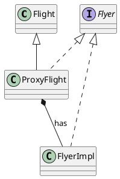

# Spring Framework: Aspect Oriented Programming with Spring AOP

## What is AOP

- common use cases
  - logging
  - exception handling
  - caching
  - user right check
  - transactions
  - tweaking a legacy appication

- evolution
  - large amount of service code

- how it works
  - before
  - execute method
  - after

- main terms
  - ascpect
    - modularistaion of a concern (orthogonal / cross-cutting concerns)
    - across multiple classes
  - join point
    - effective execution of a method
    - where the aspect will be applied
  - advice
    - action taken by an aspect
    - at a particular join point
    - before, after, around, after returning, after throwing
    - chain of advices
  - pointcut
    - predicate
    - matches join points
  - target object
    - object being advised
    - runtime proxy
  - introduction
    - declare additional methods/fields for a given class
    - advised object can have a new interface
  - AOP proxy
    - object created by the AOP framwork
    - 2 ways of creation
  - weaving
    - program transformation to apply aspect

## Introducing Spring AOP

- XML Schema based Spring AOP
  - LoggingAspect class
    - before() and after()
  - aop:config xml
    - aspect, pointcut, advices with before and after

- AspectJ based Spring AOP
  - annotations
  - @Aspect, @Before, @After
  - target class is not annotated

- @Around
  - joinPoint.proceed(): executes the function
  - more powerful that before and after
  - args of method can be retrieved
  - create proxy objects
    - JDK dynamic porxy standard
    - CGLIB proxy
      - cannot work with final classes

- @Order: priority
- @Pointcut: empty method for predicates

## Spring AOP Introductions

- Introduction
  - Spring AOP technik to declare mixin types
  - mixin
    - special type for multiple inheritance
    - to add optional features to a class
    - usage
      - class is not allowed to change
      - we want that only particular objects implement the interface
  - implementation of advising objects
    - programmatically
    - declaratively
      - @Configuration
      - @EnableAspectJAutoProxy
      - @Autowire
      - @Aspect
        - @DeclareParents

